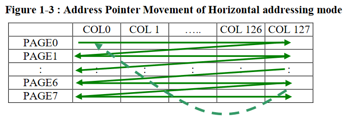

# OLED Animations
This project explores animations and fast(~30hz-50hz) drawing on the [SSD1315 OLED display from SeeedStudio](https://wiki.seeedstudio.com/Grove-OLED-Display-0.96-SSD1315/) using ESP-IDF.

# Examples


# Pre-Requisites & Connections
* ESP-IDF installation
	* Along with the some prior experience and knowledge of working with ESP-IDF
	* Experience/knowledge of I2C with ESP-IDF. [Here are the ESP-IDF I2C docs](https://docs.espressif.com/projects/esp-idf/en/latest/esp32/api-reference/peripherals/i2c.html).
* ESP32 dev board
* Connections to ESP32

	| Screen Pin | ESP32 Pin |
	| --- | --- |
	| VCC | 3.3 V |
	| GND | GND |
	| SDA | 21 |
	| SCL | 22 |
	
* Since SeeedStudio uses a proprietary connector, I decided to use a makeshift solution by just wedging 4 dupont wires into one of their connectors, while the other end is connected to the screen.


# Theory
The data sheet of the display is available [here](https://cursedhardware.github.io/epd-driver-ic/SSD1315.pdf), and it mentions the registers for configuration of the screen. The way to transfer data to this screen is by 3 methods:
* Page addressing mode
* Horizontal addressing mode (which we will be using)
* Vertical addressing mode
## Horizontal addressing mode (Important)

In this addressing mode, a page (or sub-column) of 8 vertical pixels is sent as a byte, with the most significant bit, as the lowest pixel, and the least significant bit as the highest pixel. 
After a byte(page) has been sent, the next byte(page) sent is written to the next column. After the last column has been written, the next byte(page) sent is written in the 0th column of the next page row. After the last column of the last page row is written to, the next byte sent is written to the first column of the first page row.

In conclusion, data is sent as vertical columns(pages) of pixels as bytes, until the first row pages is filled, and then the next row starts.

# Screen configuration
## I2C Setup
An `i2c_config_t` structure with the following parameters is passed to `i2c_param_config()` to set up an I2C controller:
* Mode: `I2C_MODE_MASTER`
* SDA: 21
* SCL: 22
* sda_pullup_en: `GPIO_PULLUP_ENABLE`
* scl_pullup_en: `GPIO_PULLUP_ENABLE`
* Clock Speed: 1000000

Then the I2C driver is installed by calling `i2c_driver_install()`.

## Screen Configuration
Here is the sequence of bytes we send to configure the screen:
 1. Start byte with 0x78.
 2. Control byte 0x00
 
	 > Continuation bit is set to 0 to indicate a stream of incoming bytes
	> D/C bit is set to 0 to indicate that incoming bytes are commands and are not for display(should not be written to GDDR)
	
 3. Turn display off to configure. Not necessary, but I decided to do it: 0xAE
 4. Going to configure Display Clock Divide Ratio/Oscillator Frequency: 0xD5
 5. Set Display Clock Divide Ratio to 0xF and Oscillator Frequency to 0x0: 0xF0
 6. Going to configure Multiplex Ratio(basically number of rows): 0xA8
 7. Set multiplex ratio to 63: 0x3F
 8. Going to configure display offset: 0xD3
 9. Set Display offset to 0: 0x00
 10. Set configure display start line to 0: 0x40
 11. Going to configure charge pump setting: 0x8D
 12. Enable charge pump: 0x14 
	 > Screen does not work if charge pump is disabled
	 
 13. Going to configure memory addressing mode: 0x20
 14. Set memory addressing mode to horizontal: 0x00
 15. Going to configure column address register: 0x21
 16. Set start column address: 0x0
 17. Set end column address: 0x7F
 18. Going to configure page address register: 0x22
 19. Set start page address: 0x0

 21. Set end page address: 0x7
	 > Explanation: There are 64 rows divided into 8 pages. With 0 index, there are 7 pages
	 
21. Set Segment remap: 0xA1
	> Flip display horizontally, based on physical orientation of screen
	
22. Set COM Output Scan Direction: 0xC8
	> Flip display vertically, based on physical orientation of screen
	
23. Going to configure COM pins hardware config: 0xDA
24. Set COM pins hardware config: 0x12
	> Not sure, but feels like it's set on hardware config. Probably determined by SeeedStudio based on how they configured the screen PCB board.
	
25. Going to configure contrast: 0x81
26. Set contrast to max: 0xFF
27. Going to set pre-charge period: 0xD9
28. Set Phase 1 and Phase 2 to 2 DCLK: 0x22 (default value)
	> Not sure what is this does. But has to do with selecting memory? Apparently Google says it also dims the display or reduced noise? I tried adjusting, but did not see a noticeable difference in my display
	
29. Going to configure VCOMH Deselect Level: 0xDB
30. Set VCOMH Deselect Level: 0x20
	> Not sure what this does. Did not make noticeable difference for me when I adjusted it. Left it to default value
	
31. Send GDDR contents to screen: 0xA4
	> Sending 0xA5 just turns all pixels on 
	
32. Set display to normal mode: 0xA6
	> Sending 0xA7 inverts the display. Bits that are set correspond to "off" pixels, and cleared bits correspond to "on" pixels
	
33. Deactivate scrolling: 0x2E
34. Turn the display on: 0xAF
35. Stop byte

# Screen Buffer
The total number of pixels: 128*64 = 8192. Since each byte(page) holds 8 pixels, we need 8192/8 = 1024 bytes.
	
# Writing to Screen
## Converting Cartesian Coordinates to vertically Paged buffer for SSD1315
In this section, we'll convert an `(x, y)` Cartesian point to a point in the paged buffer system expected by the display. This section forms the basis for the `drawPixel()` function in the example code provided. It is also used in the Python script to convert frames to vertical page buffers.

Imagining our 1024 byte buffer as a continuous line of pages(vertical line of 8 pixels) starting from the first column of the first page row to the last column of the last page row, we can use the  following calculations to find which byte to change, and which bit to set in the vertical page buffer, based on `(x, y)` Cartesian coordinates:

* Byte number (from 0 to 1023) = `((y / 8) * WIDTH) + x` or `((y / 8) * 128) + x`
	> This formula skips groups of 128 pixels based on how many pages down our point is in the Cartesian plane. Since 1 page is 8 pixels vertically, we skip 128 bytes every time we go 8 Cartesian points down. `x` is added since going 1 point right means skipping 1 byte(or 1 page).

* Bit number = `y % 8`
	> The bit that we set or clear has it's position somewhere in a group of 8 pixels(1 page). We can find this by calculating the remainder after `y` is divided by 8(size of a page in pixels)

Once we know which byte to replace, and which bit to set, we can define the `drawPixel()` function as follows:

```c
//WIDTH is defined as 128 in the code
// colour can be either 1(white) or 0(black), since a pixel can be either white or black
void drawPixel(int x, int y, int colour)
{
    int byteLocation = ((y / 8) * WIDTH) + x;
    uint8_t newByte = buffer[byteLocation];
    if (colour)
    {
        newByte |= 1 << (y % 8); //set a bit
    }
    else
    {
        newByte &= ~(1 << (y % 8)); //clear a bit
    }
    
    buffer[byteLocation] = newByte;
}
```
## Sending buffer to Screen
To send a buffer to the screen, we send the following commands over I2C:
1. Start byte + address
2. Control Byte: 0x40
	>Continuation bit is set to 0, indicating a stream of incoming bytes. D/C bit set to 1, indicating the incoming bytes should be sent to GDDR.
	
3. The buffer itself using `i2c_master_write()`
4. Stop byte

# Animations
A function called `directToScreenAnimation()` accepts a 2D array with sub-arrays of 1024 bytes, and the number of frames in the animation. These sub-arrays are expected to be vertical page buffers, which can directly be sent to the screen. The function sends the frames (sub-arrays) in a sequential manner to the screen. 

Filling the entire buffer by writing 1 pixel at a time, and then sending it to the screen takes about 33ms, so ~30hz.

Writing 1 pixel to the buffer, and then sending it takes about 20ms, so ~50hz.

Both frame rates are acceptable for animation, and seem smooth to the human eye. 

# How to Use this Project
1. Create a directory called `frames` in the root directory, if it does not already exist. Add black and white frames to the directory. Make sure the frames are not too big, and are 128px x 64px max. Coloured drawings on a white background will show up as white drawings on a black background on the screen. Invert the screen using the 0xA7 command in the config section if needed to reverse this effect.
2. Run `pngToBuffer.py` (it will work with most image formats for frames), and it will place/replace `aniBuf.c` in the `main` directory. `aniBuf.c` will contain vertically paged buffers of the frames provided as sub-arrays of 1024 bytes in a root 2D array called `bufferAnimation`. 
	> If your frames are smaller than 128x64 px, you can adjust some parameters in `pngToBuffer.py` to offset your frames on the screen, so that they can be displayed in specific positions. In `pngToBuffer.py` on line 46, the frames are displaced by 32px on x-axis. This means frames of size 64x64 will display in the middle of the screen, which is 128x64.
3. Replace any text in `aniBuf.h` with `extern const unsigned char bufferAnimation[][1024];`
4. Use `directToScreenAnimation(bufferAnimation, <number of frames>)` to display your frames sequentially on the screen. Some examples are already provided in the current `main.c` file.

# Multiple Animations
Multiple animations can be loaded in the `aniBuf.c` file like the current example. They must have different names and their corresponding number of frames, and `aniBuf.h` must have entires with corresponding names in the same format. The current example demonstrates individual pixel drawing, as well as multiple animations.


# Frequently Asked Questions/Troubleshooting
* My animation is cut-off/has garbage frames
	Check the number of frames you are passing to `directToScreenAnimation`
* There is nothing displayed on my screen
	Check your connections. If they are corrected, check I2C driver configuration. If that is correct, check Screen configuration.
# OLED Animations
This project explores animations and fast(~30hz-50hz) drawing on the [SSD1315 OLED display from SeeedStudio](https://wiki.seeedstudio.com/Grove-OLED-Display-0.96-SSD1315/) using ESP-IDF.

# Examples


# Pre-Requisites & Connections
* ESP-IDF installation
	* Along with the some prior experience and knowledge of working with ESP-IDF
	* Experience/knowledge of I2C with ESP-IDF. [Here are the ESP-IDF I2C docs](https://docs.espressif.com/projects/esp-idf/en/latest/esp32/api-reference/peripherals/i2c.html).
* ESP32 dev board
* Connections to ESP32

	| Screen Pin | ESP32 Pin |
	| --- | --- |
	| VCC | 3.3 V |
	| GND | GND |
	| SDA | 21 |
	| SCL | 22 |
	
* Since SeeedStudio uses a proprietary connector, I decided to use a makeshift solution by just wedging 4 dupont wires into one of their connectors, while the other end is connected to the screen.


# Theory
The data sheet of the display is available [here](https://cursedhardware.github.io/epd-driver-ic/SSD1315.pdf), and it mentions the registers for configuration of the screen. The way to transfer data to this screen is by 3 methods:
* Page addressing mode
* Horizontal addressing mode (which we will be using)
* Vertical addressing mode
## Horizontal addressing mode (Important)

In this addressing mode, a page (or sub-column) of 8 vertical pixels is sent as a byte, with the most significant bit, as the lowest pixel, and the least significant bit as the highest pixel. 
After a byte(page) has been sent, the next byte(page) sent is written to the next column. After the last column has been written, the next byte(page) sent is written in the 0th column of the next page row. After the last column of the last page row is written to, the next byte sent is written to the first column of the first page row.

In conclusion, data is sent as vertical columns(pages) of pixels as bytes, until the first row pages is filled, and then the next row starts.

# Screen configuration
## I2C Setup
An `i2c_config_t` structure with the following parameters is passed to `i2c_param_config()` to set up an I2C controller:
* Mode: `I2C_MODE_MASTER`
* SDA: 21
* SCL: 22
* sda_pullup_en: `GPIO_PULLUP_ENABLE`
* scl_pullup_en: `GPIO_PULLUP_ENABLE`
* Clock Speed: 1000000

Then the I2C driver is installed by calling `i2c_driver_install()`.

## Screen Configuration
Here is the sequence of bytes we send to configure the screen:
 1. Start byte with 0x78.
 2. Control byte 0x00
 
	 > Continuation bit is set to 0 to indicate a stream of incoming bytes
	> D/C bit is set to 0 to indicate that incoming bytes are commands and are not for display(should not be written to GDDR)
	
 3. Turn display off to configure. Not necessary, but I decided to do it: 0xAE
 4. Going to configure Display Clock Divide Ratio/Oscillator Frequency: 0xD5
 5. Set Display Clock Divide Ratio to 0xF and Oscillator Frequency to 0x0: 0xF0
 6. Going to configure Multiplex Ratio(basically number of rows): 0xA8
 7. Set multiplex ratio to 63: 0x3F
 8. Going to configure display offset: 0xD3
 9. Set Display offset to 0: 0x00
 10. Set configure display start line to 0: 0x40
 11. Going to configure charge pump setting: 0x8D
 12. Enable charge pump: 0x14 
	 > Screen does not work if charge pump is disabled
	 
 13. Going to configure memory addressing mode: 0x20
 14. Set memory addressing mode to horizontal: 0x00
 15. Going to configure column address register: 0x21
 16. Set start column address: 0x0
 17. Set end column address: 0x7F
 18. Going to configure page address register: 0x22
 19. Set start page address: 0x0

 21. Set end page address: 0x7
	 > Explanation: There are 64 rows divided into 8 pages. With 0 index, there are 7 pages
	 
21. Set Segment remap: 0xA1
	> Flip display horizontally, based on physical orientation of screen
	
22. Set COM Output Scan Direction: 0xC8
	> Flip display vertically, based on physical orientation of screen
	
23. Going to configure COM pins hardware config: 0xDA
24. Set COM pins hardware config: 0x12
	> Not sure, but feels like it's set on hardware config. Probably determined by SeeedStudio based on how they configured the screen PCB board.
	
25. Going to configure contrast: 0x81
26. Set contrast to max: 0xFF
27. Going to set pre-charge period: 0xD9
28. Set Phase 1 and Phase 2 to 2 DCLK: 0x22 (default value)
	> Not sure what is this does. But has to do with selecting memory? Apparently Google says it also dims the display or reduced noise? I tried adjusting, but did not see a noticeable difference in my display
	
29. Going to configure VCOMH Deselect Level: 0xDB
30. Set VCOMH Deselect Level: 0x20
	> Not sure what this does. Did not make noticeable difference for me when I adjusted it. Left it to default value
	
31. Send GDDR contents to screen: 0xA4
	> Sending 0xA5 just turns all pixels on 
	
32. Set display to normal mode: 0xA6
	> Sending 0xA7 inverts the display. Bits that are set correspond to "off" pixels, and cleared bits correspond to "on" pixels
	
33. Deactivate scrolling: 0x2E
34. Turn the display on: 0xAF
35. Stop byte

# Screen Buffer
The total number of pixels: 128*64 = 8192. Since each byte(page) holds 8 pixels, we need 8192/8 = 1024 bytes.
	
# Writing to Screen
## Converting Cartesian Coordinates to vertically Paged buffer for SSD1315
In this section, we'll convert an `(x, y)` Cartesian point to a point in the paged buffer system expected by the display. This section forms the basis for the `drawPixel()` function in the example code provided. It is also used in the Python script to convert frames to vertical page buffers.

Imagining our 1024 byte buffer as a continuous line of pages(vertical line of 8 pixels) starting from the first column of the first page row to the last column of the last page row, we can use the  following calculations to find which byte to change, and which bit to set in the vertical page buffer, based on `(x, y)` Cartesian coordinates:

* Byte number (from 0 to 1023) = `((y / 8) * WIDTH) + x` or `((y / 8) * 128) + x`
	> This formula skips groups of 128 pixels based on how many pages down our point is in the Cartesian plane. Since 1 page is 8 pixels vertically, we skip 128 bytes every time we go 8 Cartesian points down. `x` is added since going 1 point right means skipping 1 byte(or 1 page).

* Bit number = `y % 8`
	> The bit that we set or clear has it's position somewhere in a group of 8 pixels(1 page). We can find this by calculating the remainder after `y` is divided by 8(size of a page in pixels)

Once we know which byte to replace, and which bit to set, we can define the `drawPixel()` function as follows:

```c
//WIDTH is defined as 128 in the code
// colour can be either 1(white) or 0(black), since a pixel can be either white or black
void drawPixel(int x, int y, int colour)
{
    int byteLocation = ((y / 8) * WIDTH) + x;
    uint8_t newByte = buffer[byteLocation];
    if (colour)
    {
        newByte |= 1 << (y % 8); //set a bit
    }
    else
    {
        newByte &= ~(1 << (y % 8)); //clear a bit
    }
    
    buffer[byteLocation] = newByte;
}
```
## Sending buffer to Screen
To send a buffer to the screen, we send the following commands over I2C:
1. Start byte + address
2. Control Byte: 0x40
	>Continuation bit is set to 0, indicating a stream of incoming bytes. D/C bit set to 1, indicating the incoming bytes should be sent to GDDR.
	
3. The buffer itself using `i2c_master_write()`
4. Stop byte

# Animations
A function called `directToScreenAnimation()` accepts a 2D array with sub-arrays of 1024 bytes, and the number of frames in the animation. These sub-arrays are expected to be vertical page buffers, which can directly be sent to the screen. The function sends the frames (sub-arrays) in a sequential manner to the screen. 

Filling the entire buffer by writing 1 pixel at a time, and then sending it to the screen takes about 33ms, so ~30hz.

Writing 1 pixel to the buffer, and then sending it takes about 20ms, so ~50hz.

Both frame rates are acceptable for animation, and seem smooth to the human eye. 

# How to Use this Project
1. Create a directory called `frames` in the root directory, if it does not already exist. Add black and white frames to the directory. Make sure the frames are not too big, and are 128px x 64px max. Coloured drawings on a white background will show up as white drawings on a black background on the screen. Invert the screen using the 0xA7 command in the config section if needed to reverse this effect.
2. Run `pngToBuffer.py` (it will work with most image formats for frames), and it will place/replace `aniBuf.c` in the `main` directory. `aniBuf.c` will contain vertically paged buffers of the frames provided as sub-arrays of 1024 bytes in a root 2D array called `bufferAnimation`. 
	> If your frames are smaller than 128x64 px, you can adjust some parameters in `pngToBuffer.py` to offset your frames on the screen, so that they can be displayed in specific positions. In `pngToBuffer.py` on line 46, the frames are displaced by 32px on x-axis. This means frames of size 64x64 will display in the middle of the screen, which is 128x64.
3. Replace any text in `aniBuf.h` with `extern const unsigned char bufferAnimation[][1024];`
4. Use `directToScreenAnimation(bufferAnimation, <number of frames>)` to display your frames sequentially on the screen. Some examples are already provided in the current `main.c` file.

# Multiple Animations
Multiple animations can be loaded in the `aniBuf.c` file like the current example. They must have different names and their corresponding number of frames, and `aniBuf.h` must have entires with corresponding names in the same format. The current example demonstrates individual pixel drawing, as well as multiple animations.


# Frequently Asked Questions/Troubleshooting
* **My animation is cut-off/has garbage frames**
	Check the number of frames you are passing to `directToScreenAnimation()`
* **There is nothing displayed on my screen**
	Check your connections. If they are corrected, check I2C driver configuration. If that is correct, check screen configuration using I2C. Try lowering I2C clock rate to 400Khz instead of 1Mhz