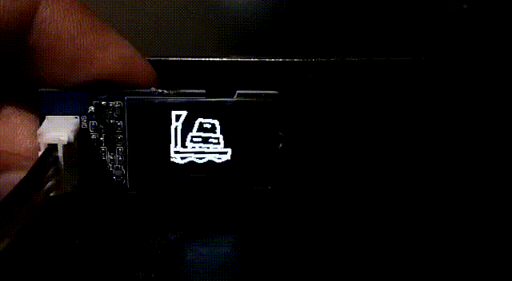
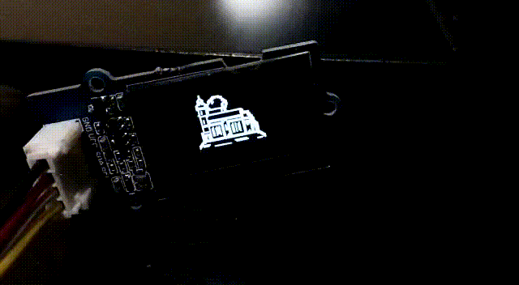
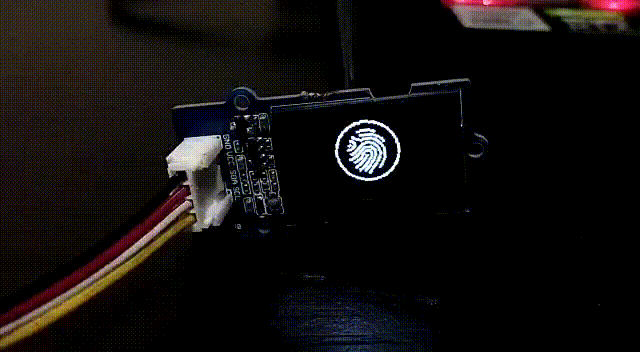
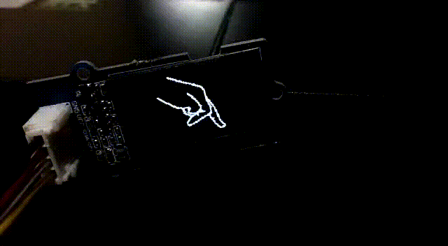
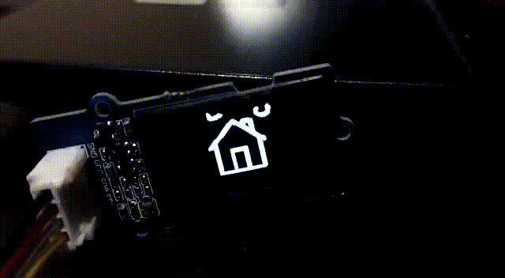
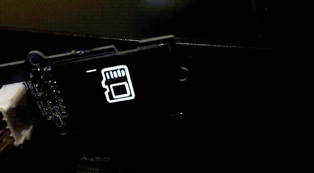
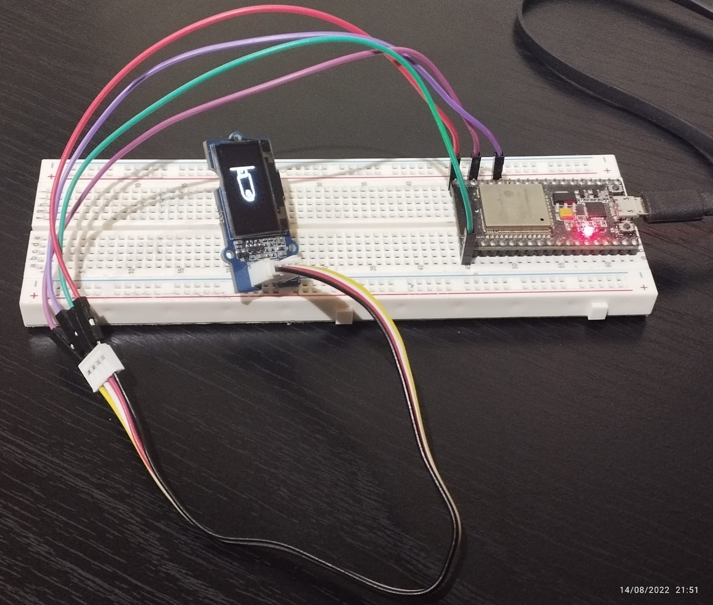

# OLED Animations
This project explores animations and fast(~30hz-50hz) drawing on the [SSD1315 OLED display from SeeedStudio](https://wiki.seeedstudio.com/Grove-OLED-Display-0.96-SSD1315/) using ESP-IDF.

# Examples

# Pre-Requisites & Connections
* ESP-IDF installation
	* Along with the some prior experience and knowledge of working with ESP-IDF
* ESP32 dev board
* Connections to ESP32

	| Screen Pin | ESP32 Pin |
	| --- | --- |
	| VCC | 3.3 V |
	| GND | GND |
	| SDA | 21 |
	| SCL | 22 |
	
* Since SeeedStudio uses a proprietary connector, I decided to use a makeshift solution by just wedging 4 dupont wires into one of their connectors, while the other end is connected to the screen.

